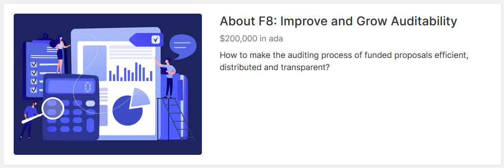

# F8 - Improve and Grow Auditability

## Overview

The [Fund 8 Improve and Grow Auditability Challenge](https://cardano.ideascale.com/c/campaigns/26447/about) was renewed by Stephen Whitenstall in November 2021.  The Challenge was successfully voted for by 415 Wallets, 98,548,757 ADA Yes and 9,414,286 ADA No.

### Challenge Fund Amount

$200,000 in ADA

### Summary description

How to make the auditing process of funded proposals efficient, distributed and transparent?

## Campaign Brief

When Fund7 happens we will be close to 300 funded proposals. It is extremely important that these proposals are evaluated/audited to see if they are delivering and if the ROI is being in line with what has been established initialy.

Currently, IOG is in charge of monitoring the development of these funded proposals, but when there are hundreds of funded proposals this will be an overwhelming work for IOG.

The Auditability challenge aims to ensure transparency in the use of Cardano's treasury resources, which will allow the Cardano community to have more information on the development of funded proposals through a checks and balances system.

### **Why is it important?**

It's important that the funded proposals are evaluated to see if they are delivering what was established in their mission..

### **What does success look like?**

Several projects evaluating funded proposals, providing reports, articles and metrics on the development and implementation of the projects.

### **Key Metrics to measure**

* Number of funded proposals audited
* Considering that the idea is to audit and report on the development of proposals in different challenges, it is important that success metrics are thought out in relation to each challenge.
* Number of reports, articles and videos/podcasts on:
* Performance
* Achievements
* Financials
* Number of onboarded developers.
* Number of commits in funded proposal repositories (Github)
* Indicators of: transactions, volume and unique wallets interacting with dapps.
* Number of smart contracts audited.
* Social media engagement indicators.

