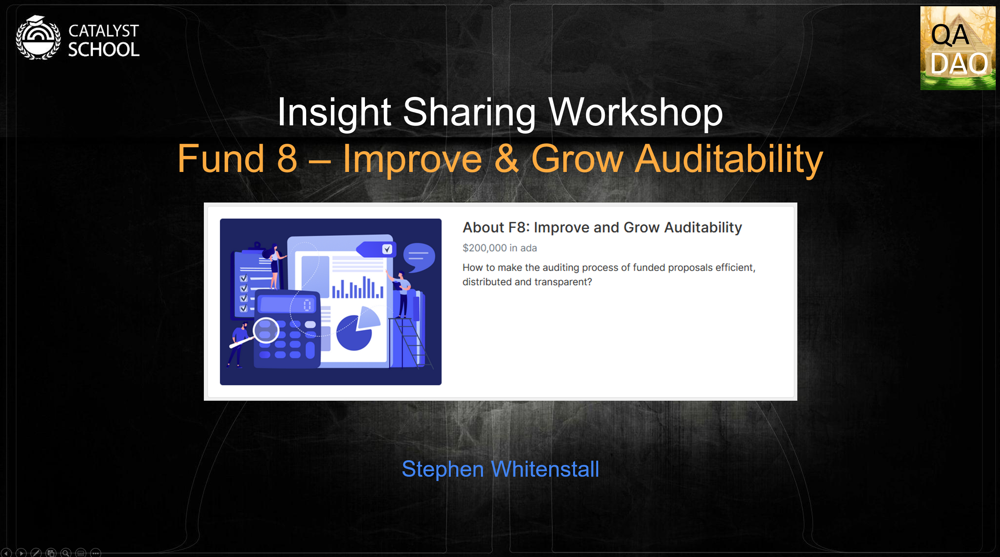

# Insight Sharing

.png>)

## Insight Sharing Workshops

[QADAO ](https://quality-assurance-dao.github.io)in collaboration with Catalyst School prepared an Insight Sharing Workshop as part of the funded proposal "[Insight Sharing Workshops - TCS](https://cardano.ideascale.com/c/idea/384064)".

### What are Insight Sharing Workshops? 

Adapted from [Source](https://docs.google.com/document/d/1rN7dWXLH\_v2UQI3mcMP1uoosQ2FrHLwZJSIpx9tMqYI/edit?usp=sharing)

The Insight Sharing Workshop Series is a new way of brainstorming about Catalyst Challenges, aiming to bring together proposers, community advisors, challenge teams and domain experts into a discussion about specific challenges and how to make the best out of it.

Taking place at the beginning of Fund 8 during the insight sharing phase. Domain experts will have a list of recommended topics to be covered but are free to modify them, include or exclude topics as they see fit.

### Execution 

The workshops take place in Zoom meetings and will last up to 2 hours. One or two domain experts will be invited to participate, and one or two Catalyst School members will be there to provide all the required support. The meeting recording will be uploaded to [Catalyst School’s YouTube channel](https://www.youtube.com/channel/UCIPvRvMoxhmHLUuPPcsMmmg/videos).

The goal is to have an interactive, open conversation with everyone. Presenters decide the details of the presentation, but the idea is to leave space for everyone to interact and share their perspectives.

### Workshop topics (preferable):

* Slides
* Presentation of the challenge
* Proposer perspective (What topics should cover/focus a proposer)
* CA perspective (What topics should cover/focus on a CA in the assessments)
* Explanation of challenge KPIs&#x20;
* Overview of previously funded proposals / Success stories (if applicable)

## Auditability Insight Sharing Workshop

### What are Insight Sharing Workshops?

.png>)

The Insight Sharing Workshop Series is a new way of brainstorming about Catalyst Challenges

Aiming to bring together :

Proposers

Community advisors

Challenge teams

Domain experts&#x20;

into a discussion about specific challenges and how to make the best out of it.

[F7: Community Events](https://cardano.ideascale.com/c/campaigns/26234/stage/all/ideas/unspecified)

The Series is the product of an "[Insight Sharing Workshops - TCS](https://cardano.ideascale.com/c/idea/384064)" proposal submitted in the Fund 7 [Community Events Challenge](https://cardano.ideascale.com/c/campaigns/26234/about) and successfully voted for in February 2022.

### Presentation of the challenge

The Improve & Grow Auditability Challenge was first proposed in April 2021 by Rodrigo Pacini in Fund 5 with his [F5: Fund 6 & 7 challenge setting Improve and Grow Auditability](https://cardano.ideascale.com/c/idea/352101).

It was [successfully voted for in August 2021](https://catalyst-swarm.gitbook.io/catalyst-swarm-genesis/august-2021/fund-5-voting-results-august-2021#fund-6-challenge-setting) with 1800 Wallets, 164,854,742 ADA FOR & 144 Wallets, 41,493,373 AGAINST.

